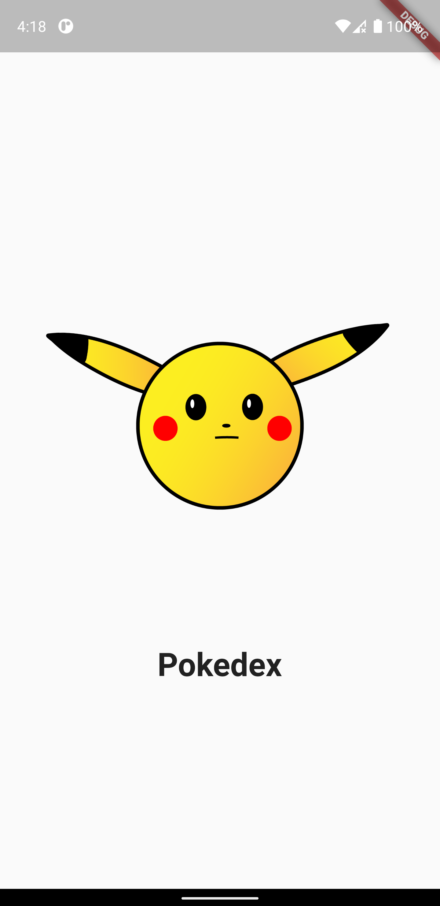

# Pokedex Flutter

- Architecture Used: MVC
- API: https://documenter.getpostman.com/view/10670805/SzS2xToN#be879560-9b35-4fe7-ba0a-fb4c43bfd26f
- State Management Package: Provider

## Packages Used:

- http: ^0.13.5
- lottie: ^2.0.0
- provider: ^6.0.4
- flutter_form_builder: ^7.7.0
- form_builder_validators: ^8.4.0
  
  
## Screenshots:

